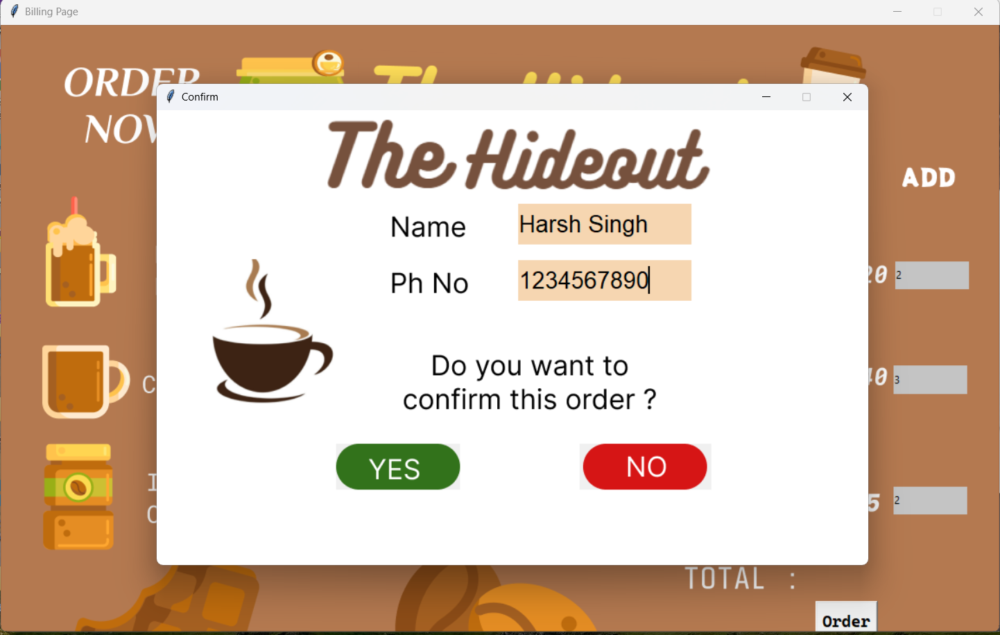

# The Hideout 🏡

Welcome to The Hideout, a cozy place for people to come and hang out, chat, and enjoy delicious beverages. ☕

## How to Run 🚀

To run The Hideout, follow these steps:

1. Clone the repository:
   ```bash
   git clone https://github.com/kom-senapati/The-Hideout.git
   cd The-Hideout
   ```

2. Install tk module:
   ```bash
   pip install tk
   ```

3. Run the main Python script:
   ```bash
   python main.py
   ```

## How to Contribute 🤝

We welcome contributions from the community! Here's how you can get involved:

1. **Fork the Repository**: Click the "Fork" button at the top right of the repository's page.

2. **Create a New Branch**: Create a new branch for your changes:
   ```bash
   git checkout -b feature/your-feature-name
   ```

3. **Make Your Changes**: Implement your enhancements, bug fixes, or new features.

4. **Push to Your Branch**: Push your changes to your forked repository:
   ```bash
   git push origin feature/your-feature-name
   ```

5. **Create a Pull Request**: Open a pull request on the main repository and describe your changes. We'll review and merge your contribution.

## Contributing Guidelines 📝

Please make sure to follow our contributing guidelines. For major changes, open an issue first to discuss the proposed changes.

## Screenshots 📷

Here are some screenshots of The Hideout in action:





## Authors 🧑‍💻


[kom-senapati](@kom-senapati)

Feel free to reach out if you have any questions or suggestions. Enjoy your time at The Hideout! 🌟